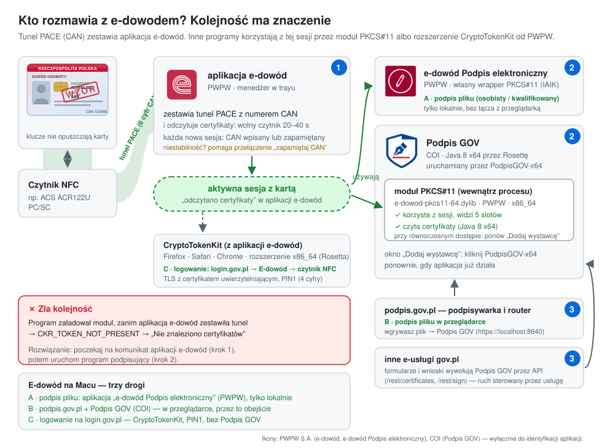

# Architektura: kto rozmawia z e-dowodem

[← README](README.md) · [Instalacja](INSTALL.md) · [Podpisywanie](RUN.md) · [Rodzaje podpisów](PODPISY.md) · **Architektura**

## Moduł PKCS#11 od PWPW nie jest klasycznym modułem

Typowy moduł PKCS#11, np. do karty kryptograficznej z certyfikatem kwalifikowanym, sam rozmawia z kartą.
Aplikacja ładuje go, a moduł otwiera czytnik, wybiera aplet na karcie i zwraca jej tokeny.

Moduł e-dowodu (`e-dowod-pkcs11-64.dylib`) działa inaczej:

1. **Sam nie nawiązuje bezpiecznego połączenia z kartą.** E-dowód wymaga szyfrowanego kanału PACE,
   zestawianego z numerem CAN (6 cyfr z przodu dowodu). Robi to **aplikacja e-dowód** od PWPW
   (menedżer w trayu), która pyta o CAN, zestawia kanał i odczytuje certyfikaty.
2. **Moduł korzysta z gotowej sesji.** Gdy aplikacja e-dowód zakończy odczyt, moduł pokazuje
   **5 wirtualnych slotów**, po jednym na każdą funkcję dowodu:

   | Slot | Token (nazwa w module) | Nazwa urzędowa | PIN | PUK |
   |---|---|---|---|---|
   | 0 | E-Dowód (Authentication) | **profil osobisty**: certyfikat identyfikacji i uwierzytelnienia (logowanie e-dowodem) | 4 cyfry (PIN1) | **tak**: PUK dowodu (8 cyfr) |
   | 1 | E-Dowód (Presence) | **potwierdzenie obecności**: certyfikat potwierdzenia obecności | brak | nie dotyczy |
   | 2 | E-Dowód (Authorization) | **podpis osobisty**: certyfikat podpisu osobistego | 6 cyfr (PIN2) | **tak**: PUK dowodu (8 cyfr) |
   | 3 | E-Dowód (Qualified) | **podpis kwalifikowany**: certyfikat kwalifikowany, opcjonalny, kupowany u PWPW (Sigillum) | 8 cyfr | **tak**: PUK dowodu (8 cyfr), **niezbędny do zakupu i aktywacji** certyfikatu w PWPW¹ |
   | 4 | eMRTD | **dokument podróży**: dane do kontroli granicznej (ICAO), np. zdjęcie | brak (dostęp przez CAN) | nie dotyczy |

   ¹ Z doświadczenia autora: aktywacja certyfikatu kwalifikowanego w PWPW wymaga kodu PUK z koperty odebranej
   w urzędzie. **Niepotwierdzone:** czy na starszych dowodach trzeba było zaznaczyć tę opcję we wniosku (i czy bez
   tego potrzebny jest nowy dowód), oraz czy dotyczy to nowszych wersji e-dowodu. Potwierdzone jest tylko pole
   we wniosku dla **podpisu osobistego**.

   > **Podpis zaufany nie ma własnego slotu na dowodzie.** Składa go serwer Profilu Zaufanego, a potwierdzić go
   > można SMS-em, bankiem, mObywatelem **albo e-dowodem** (smartfon z NFC lub komputer z czytnikiem NFC),
   > czyli przez profil osobisty z PIN1. Porównanie wszystkich podpisów: [PODPISY.md](PODPISY.md).

3. **Bez tej sesji moduł widzi tylko czytnik.** Zwraca wtedy 1 slot i `CKR_TOKEN_NOT_PRESENT`, mimo że
   dowód leży na czytniku. Czytnik tylko krótko mrugnie (ok. 2 s, odczyt ATR) i nic więcej się nie dzieje.
   Podpis GOV pokazuje wówczas „Nie znaleziono certyfikatów” bez żadnej wskazówki.

### Kody PIN i PUK: skąd je mieć

Według [gov.pl — Uzyskaj dowód osobisty](https://www.gov.pl/web/gov/uzyskaj-dowod-osobisty):

- **PIN1 (4 cyfry, logowanie)** i **PIN2 (6 cyfr, podpis osobisty)** ustalasz w urzędzie przy odbiorze dowodu.
  PIN2 tylko wtedy, gdy we wniosku zaznaczono podpis osobisty. Możesz to też zrobić **później, w dowolnym urzędzie gminy**.
- **PUK (8 cyfr)** dostajesz w kopercie razem z dowodem. Służy do odblokowania PIN-ów po 3 błędnych próbach i do ich zmiany.
  Możesz go nie odebrać od razu: **czeka w urzędzie, który wydał dowód**.
- Gdy dowód odbiera **pełnomocnik**, i tak musisz **osobiście** przyjść do urzędu, żeby ustalić PIN-y lub odebrać PUK.
- Więcej o zmianie PIN-ów i o PUK: [gov.pl/web/e-dowod](https://www.gov.pl/web/e-dowod).

### Tunel PACE i numer CAN

Szyfrowany kanał z kartą (**tunel PACE**) zestawia aplikacja e-dowód, a każda nowa sesja wymaga numeru CAN:
wpisanego ręcznie albo zapamiętanego w aplikacji (opcja „zapamiętaj CAN”). Z praktyki: gdy sesja działa
niestabilnie, pomaga wyłączenie i ponowne włączenie tej opcji.

### Kto korzysta z sesji

| Program | Dostawca | Jak sięga do karty | Wynik na Apple Silicon |
|---|---|---|---|
| **e-dowód Podpis elektroniczny** (eDOSign) | PWPW | moduł PKCS#11 przez własny wrapper IAIK z własną biblioteką natywną | ✅ widzi certyfikaty, podpisuje (podpis osobisty, kwalifikowany) |
| **Podpis GOV** (przez PodpisGOV-x64) | COI | moduł PKCS#11: lista certyfikatów przez API IAIK, podpis przez SunPKCS11 | ✅ **podpis osobisty złożony na podpis.gov.pl**; widzi też certyfikat kwalifikowany (2026-10-02) |
| Safari, Pęk kluczy, Chrome | Apple / PWPW | rozszerzenie CryptoTokenKit | nie testowano |

**Wynik analizy (2026-10-02).** Moduł PWPW zwraca poprawne certyfikaty każdą drogą: bezpośrednio, przez
wrapper Javy 8 i Javy 21 oraz przez kod Podpis GOV (`PKCS11TokenUtils.getPKCS11Token`), także ze ścieżką
zawierającą „ó”. Pojedynczy błąd „Wystąpił błąd ładowania biblioteki: null” wystąpił, gdy kilka komponentów
naraz korzystało z karty. Podpis GOV nie sprawdza wtedy, czy odczytany certyfikat nie jest pusty
(`getByteArrayValue()` → `null` → `NullPointerException`). Narzędzia: `tools/p11proxy/` (logujący moduł
pośredniczący PKCS#11) i `tools/P11Values.java`.

Do tej samej karty sięga też **rozszerzenie CryptoTokenKit** od PWPW, czyli systemowy dostęp macOS dla
Safari, Pęku kluczy i Chrome. Trzy komponenty jednego dostawcy korzystają z jednej karty i jednego wolnego
łącza NFC, więc kolejność ma znaczenie.

## Właściwa kolejność

1. **Aplikacja e-dowód:** połóż dowód, wpisz CAN i poczekaj na komunikat o odczytanych certyfikatach.
   Na wolnym czytniku (np. ACR122U) trwa to 20–40 sekund, a czytnik w tym czasie daje sygnał i mruga.
2. **Podpis GOV** (przez `PodpisGOV-x64.app`). Okno z opcją „Dodaj wystawcę” otworzysz, klikając
   `PodpisGOV-x64` ponownie, gdy aplikacja już działa.
3. **Strona gov.pl** łączy się z Podpis GOV przez `https://localhost:8640` i prosi o podpis.

## Gdzie działa nasze obejście

Obejście z tego repozytorium dotyczy wyłącznie kroku 2. Oprócz uruchamiania Podpis GOV na Javie x64 launcher
utrzymuje w `~/.pksigner/config.ini` ścieżkę do modułu bez „ó”. Podpis GOV ładuje moduł **dwiema drogami**:
listę certyfikatów przez API IAIK (radzi sobie z „ó”) i **sam podpis przez SunPKCS11** (nie radzi sobie). Podpis GOV ma wbudowaną Javę dla Apple Silicon
(arm64), a moduł PWPW istnieje tylko dla procesorów Intel (x86_64). Skrypt uruchamia więc Podpis GOV
na Javie x64 z JavaFX (Azul Zulu 8) przez Rosettę 2. Kroki 1 i 3 działają bez zmian.

Szczegóły techniczne: [README — Przyczyna](README.md#przyczyna).

## Jak to sprawdzono

- Długości PIN-ów i flagi tokenów odczytano z karty **bez wpisywania PIN-u** (`ulMinPinLen` / `ulMaxPinLen`):
  `zsh tools/test-podpisow.sh` (krok 1).
- Brak tokenów przed zakończeniem odczytu w aplikacji e-dowód i 5 tokenów po nim:
  `zsh patch-podpisgov-x64.sh --check`.
- Zatrzymanie samego rozszerzenia CryptoTokenKit nie pomaga. Moduł potrzebuje sesji aplikacji e-dowód.

Ikony aplikacji na diagramie należą do PWPW S.A. (e-dowód) i COI (Podpis GOV). Użyto ich wyłącznie do
identyfikacji aplikacji.
